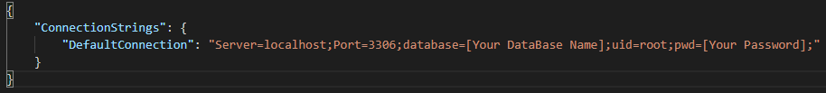

# ## Eau Claire's Salon

##### Date: **05/22/2021**

#### By **_Salim Mayan_**

## Description

#### An MVC app to track _Stylists_ and _Clients_. User will be able to add _Stylist's_ employed by the Salon and link _Clients_ associated with each _Stylist_.  Stylist/Client relationship is _One-To-Many_ and hence a _Client_ can only belong to one _Stylist_. Project demonstrates knowledge of MVC design pattern along with Database basics to successfully build web application. 

## Setup/Installation Requirements

1. Clone this repository from GitHub using `git clone https://github.com/salimmayan/HairSalon.Solution`

2. Open directory `HairSalon.Solution` in VS Code

3. To install packages listed in `.csproj` file, from command line navigate to `HairSalon`  directory and then run  `dotnet restore` (**'obj'** directory would get created in `HairSalon` directory)

4. To create internal content for build, from command line navigate to `HairSalon`  directory and then run  `dotnet build` (**'bin'** directory would get created in `HairSalon`  directory)

5. **Re-create Database with MySQL Workbench Import Functionality**: Use file`salim_mayan.sql` to recreate Database with required tables. From _MySQL Workbench_ inititate the following steps ...
-   In the  _Navigator_  >  _Administration_  window, select  _Data Import/Restore_.
    
-   In  _Import Options_  select  _Import from Self-Contained File_.
    
-   Navigate to the file at `HairSalon\salim_mayan.sql`
    
-   Under  _Default Schema to be Imported To_, select the  _New_  button.
    
    -   Enter a name for your database (**Note:** File `HairSalon.Solution\HairSalon\appsettings.json` should be updated to reflect the new Database name (in below image of `appsettings.json`, update Database name and Password) )
    
    - Click  _Ok_.
    - Click  _Start Import_.
    - Reopen the  _Navigator_  >  _Schemas_  tab. Right click and select  _Refresh All_ (new database will appear with the name you.

6. **Execute Application:** Navigate to `./HairSalon` directory and enter `dotnet run`

7. In Browser enter URL `http://localhost:5000` to access application

⚠️  *Note*: To run project locally you need to have .NET Core (confirm running of .NET Core using command `dotnet --version` in command line)

| **Spec** |
## Running Tests:

-  Tests are not applicable for this application

## Known Bugs

* No Known bugs

## Improvement opportunities

* Add more styling.
* Improve routing/navigation between pages

## Technologies Used

-   C# 9
-   ASP.NET MVC
-   .NET Core v5.0
-   Razor View Engine
-   RESTful Routing
-   CRUD & HTTP
-   Bootstrap
-   REPL
-   Git and GitHub
-   Entity Framework Core

## Support and contact details

* For questions, comments, or concerns *[email author](mailto:mailsalim@gmail.com?subject=[GitHub])*

### License

*{This software is licensed under the MIT license}*

Copyright (c) 2021 **_{Salim Mayan}_**